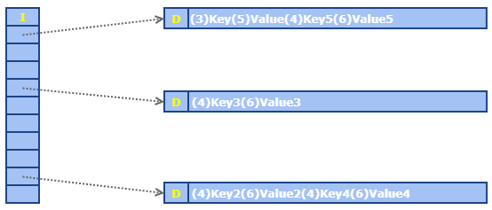
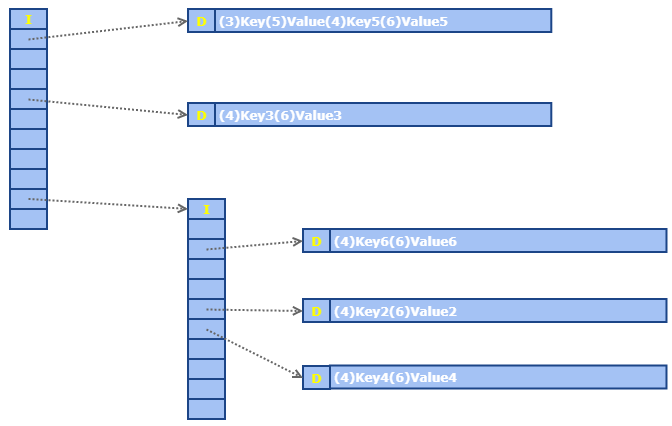

# hash-table-tree

It is a data structure for fast disk-based unsorted key-value databases.

It implements a hash table on database pages.

It uses 2 types of database pages:

1. Index page
2. Data page

The keys and values are stored on the data pages with a data length before each.

When there is no more free space on a data page to store a new or updated key/value pair we:

1. allocate a new index page
2. choose a new hash salt and store it on the index page
3. reshash all the keys in this data page with this new salt and store the pairs on new data pages

So we don't need to rehash the entire database.

By using a different salt than in the previous index pages the hash function will generate different hashes for the same keys, so the keys on that new index page will be spreaded on separate pages.

This action of adding new index pages is limited by the total possible unique salts. Each salt is stored in the index page.
If it uses 1 byte we have 256 possible different salts for each path. This means the db can store at least nearly 1021^256 keys.
This number is way higher if we use 2 bytes to store the salt.

Note that the same salt can be used in other paths and it must be unique only in the same path up to the root page.

## Performance

The performance gain (at least on reads) comes from the amount of pointers on each index page and the consequence of requiring less index pages to be loaded (less disk I/O) when searching for a key.

We can have nearly 1021 pointers in a hash-table-tree 4kB page.

A common B-tree with a 4 byte key has half that number of pointers. And with an 8 bytes key the number of pointers is 1/3.

## Limitations

As in any hash table, it only supports unsorted data.

It uses A LOT of disk space if the key+value size is way lower than 4kB. It is as a trade-off for performance. But it is really good when used to store data nearly to 4090 bytes (key + value + length prefixes).

## About the Code

This code is just a proof-of-concept, it does not implement transactions and it is not safe (yet).
